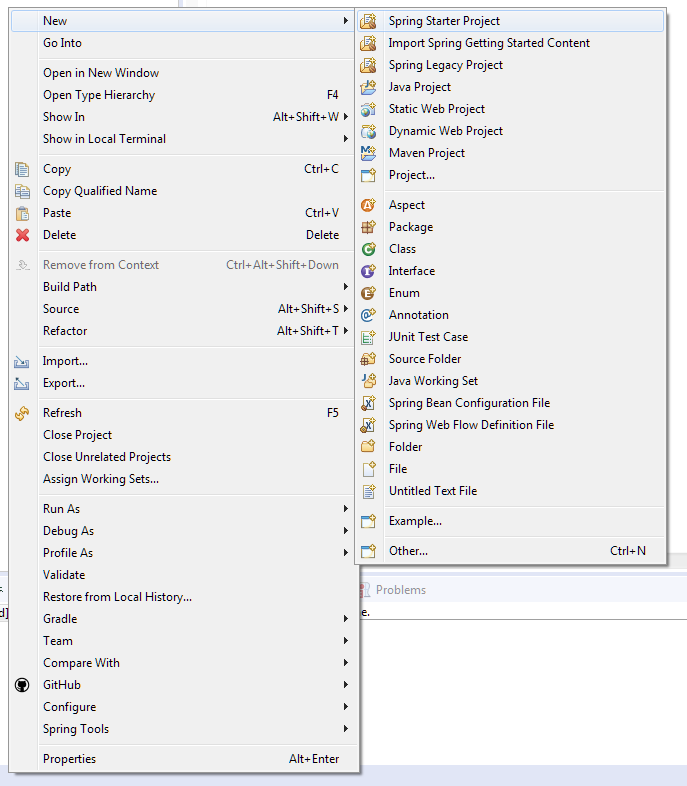
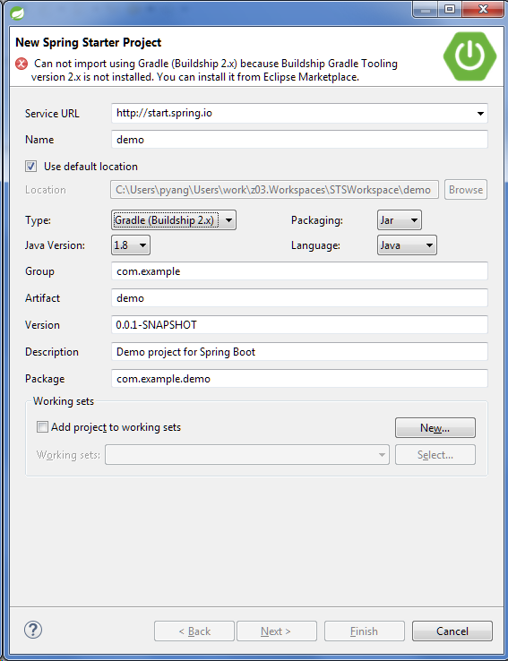
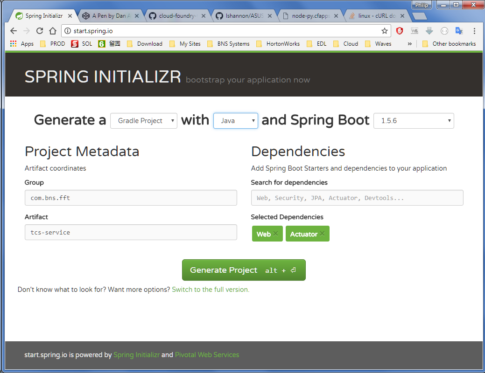

# Spring Start Project

Currently, there is no support for creating a Spring start project using Gradle within STS due to the lack of support for Gadle Buildship extension.

Instead, you can do the following two things:

1. Use Spring Initializr to create the project and download the zip file.

2. Import the source code into STS using Import ... > Gradle > Existing Gradle Project
